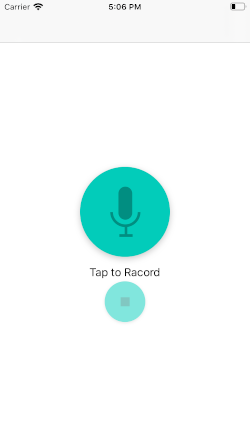

# Voice Record, Modulate and Play

An iPhone app that will allow users to record their voice and will then modulate the recorded audio to sound like different effects

### Features

- Record and play voice
- Modulate the recorded audio like Slow, Fast, High pitch, Low pitch, Echo, Reverb

### Minimum Requirements

- Xcode 7.2
- Swift 2.0

### Screenshots

### License

Copyright (c) 2020 Zahidur
